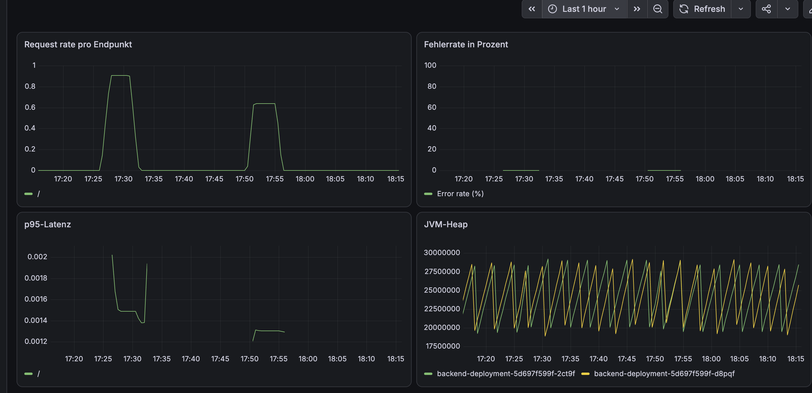

# Kubernetes Ingress Example

A minimal but complete demonstration of **host-based ingress routing** in Kubernetes.
Two independent services — a React (Vite) frontend and a Spring Boot backend — are
exposed through a single NGINX Ingress Controller and separated by hostname rather
than by URL path.

The project also includes a **Prometheus + Grafana monitoring stack**. The backend is
instrumented via Spring Boot Actuator and Micrometer, metrics are scraped through a
`ServiceMonitor`, and the Grafana dashboard is provisioned as code — verified to
reload automatically after a full ConfigMap delete/recreate cycle.




---

## Architecture

```
                        ┌──────────────────────────┐
   myappfrontend.com ──►│                          │──► hello-frontend:80  ──► frontend pods
                        │  NGINX Ingress Controller│
   myappapi.com      ──►│  (host-based routing)    │──► hello:8080         ──► backend pods (x2)
                        └──────────────────────────┘                            │
                                                                                 │ :8081
                                                                                 ▼
                                                       Prometheus ──► Grafana   /actuator/prometheus
```

Both hostnames resolve to the same ingress controller. NGINX inspects the HTTP `Host`
header and routes to the matching service — this is the core mechanism the project
demonstrates.

---

## Stack

| Layer | Technology |
|---|---|
| Frontend | React + Vite (TypeScript), served on port 80 via nginx |
| Backend | Spring Boot 3.4.4, Java 21, Maven |
| Ingress | NGINX Ingress Controller |
| Metrics | Spring Boot Actuator + Micrometer (Prometheus format) |
| Monitoring | Prometheus, Grafana (kube-prometheus-stack via Helm) |
| Local cluster | Minikube |

---

## Prerequisites

- Docker
- Minikube
- kubectl
- Helm 3
- JDK 21 (for local backend builds — see [Building the backend](#building-the-backend))

---

## Quickstart

### 1. Start the cluster and enable ingress

```bash
minikube start
minikube addons enable ingress
```

> **On macOS with the Docker driver:** Minikube's IP is not directly reachable from
> the host. After enabling the addon, run `minikube tunnel` in a separate terminal —
> this exposes the ingress controller on `127.0.0.1`. Keep it running for the rest of
> this guide.

### 2. Map the hostnames

```bash
echo "127.0.0.1 myappapi.com myappfrontend.com" | sudo tee -a /etc/hosts
```

### 3. Build the images inside Minikube's Docker daemon

Deployments use `imagePullPolicy: Never`, so images must be built in Minikube's own
Docker environment — not on the host.

```bash
eval $(minikube docker-env)
```

This applies to the current terminal session only; re-run it in any new shell.

#### Building the backend

```bash
cd backend-service
./mvnw clean package -DskipTests
docker build -t new-backend-image:latest .
cd ..
```

Requires a local JDK 21 installation, since the JAR is built on the host before the
Docker build copies it in.

#### Building the frontend

```bash
docker build -t new-frontend-image:latest kubernetes-frontend/
```

This is a self-contained multi-stage build — no local Node.js installation required.

### 4. Deploy

```bash
kubectl apply -f k8s/backend-deployment.yaml
kubectl apply -f k8s/backend-service.yaml
kubectl apply -f k8s/frontend-deployment.yaml
kubectl apply -f k8s/frontend-service.yaml
kubectl apply -f k8s/ingress.yaml

kubectl rollout status deployment/backend-deployment
```

### 5. Verify

```bash
curl -I http://myappapi.com
```

Open `http://myappfrontend.com` in a browser, submit a message through the text
field, then confirm it reaches the backend:

```bash
kubectl logs -l app=backend --tail=20
```

---

## Monitoring

### Install the stack

```bash
helm repo add prometheus-community https://prometheus-community.github.io/helm-charts
helm repo update

helm install monitoring prometheus-community/kube-prometheus-stack \
  -n monitoring --create-namespace \
  -f k8s/monitoring/values-prometheus.yaml --wait --timeout 10m

kubectl apply -f k8s/monitoring/servicemonitor.yaml
kubectl apply -f k8s/monitoring/dashboard-cm.yaml
```

### Access

```bash
kubectl port-forward -n monitoring svc/monitoring-grafana 3000:80
# http://localhost:3000  —  admin / admin (set in values-prometheus.yaml)

kubectl port-forward -n monitoring svc/monitoring-kube-prometheus-prometheus 9090:9090
# http://localhost:9090/targets
```

The `backend` target should show as **UP** with two endpoints — one per replica.

### What is measured

The backend exposes metrics on a **separate management port (8081)**, at
`/actuator/prometheus`. This is a deliberate separation from the application port
(8080), which is the only port routed by the Ingress — see
[Design decisions](#design-decisions).

Prometheus discovers scrape targets through a `ServiceMonitor` that selects the
service by label, so scaling the deployment automatically adds new pods to the
target list — no manual reconfiguration.

The dashboard follows the RED pattern:

| Panel | Query |
|---|---|
| Request rate by endpoint | `sum(rate(http_server_requests_seconds_count{application="backend-service"}[5m])) by (uri)` |
| Error rate (%) | `(sum(rate(http_server_requests_seconds_count{application="backend-service",status=~"5.."}[5m])) or vector(0)) / sum(rate(http_server_requests_seconds_count{application="backend-service"}[5m])) * 100` |
| p95 latency | `histogram_quantile(0.95, sum(rate(http_server_requests_seconds_bucket{application="backend-service"}[5m])) by (le, uri))` |
| JVM heap per pod | `sum(jvm_memory_used_bytes{application="backend-service",area="heap"}) by (pod)` |

The dashboard is stored as JSON in `k8s/monitoring/dashboards/` and loaded into
Grafana via a labeled ConfigMap — verified to reload automatically after
`kubectl delete configmap ... && kubectl apply -f ...`, without any manual re-import.

---

## What this demonstrates

- **Host-based ingress routing** — one controller, one IP, two hostnames, two services
- **Service discovery via label selectors** — Kubernetes services find pods by label,
  and Prometheus finds services the same way
- **Why an Ingress is needed** — without it, each service would require its own
  `NodePort` or `LoadBalancer`, with no shared entry point or central routing layer
- **Application metrics as a first-class concern** — instrumentation, scraping, and
  dashboards are all defined in version control, not clicked together manually
- **Working behind a TLS-inspecting corporate proxy** — both application builds trust
  an optional corporate root CA without disabling certificate verification

---

## Design decisions

**Host-based routing instead of path-based.**
Both services serve from `/`, so path-based routing would require URL rewriting to
strip prefixes. Separate hostnames keep each application's routing untouched and
mirror how frontend and API are commonly split in production.

**Actuator on a dedicated management port (8081).**
The ingress rule for `myappapi.com` uses `pathType: Prefix` with `path: "/"`, which
forwards *everything* to the backend service. Had Actuator run on port 8080, endpoints
like `/actuator/prometheus` would be publicly reachable through the ingress. Moving
management traffic to a separate port — one the ingress does not route — keeps it
cluster-internal.

**Histogram buckets enabled explicitly.**
Prometheus computes percentiles at query time from cumulative buckets, so
`histogram_quantile()` returns nothing unless the application exports them. This is
enabled via `management.metrics.distribution.percentiles-histogram` in
`application.properties`.

**`or vector(0)` in the error-rate query.**
Prometheus does not create a zero-valued time series for a label combination that has
never occurred — a query filtered to `status=~"5.."` returns no data at all when no
error has ever happened, not a flat 0. Without the fallback, the panel would show
"No data" during normal operation, which is misleading. `or vector(0)` makes the
distinction between *no data* and *a true zero* explicit.

**Dashboard as a ConfigMap rather than clicked together in the UI.**
The Grafana sidecar loads any ConfigMap labeled `grafana_dashboard: "1"`, so the
dashboard is versioned alongside the manifests and survives a full cluster rebuild.
Grafana's newer internal dashboard schema (`dashboard.grafana.app/v2`) is not the
format the sidecar consumes — the exported JSON here is the classic schema, retrieved
via `GET /api/dashboards/uid/<uid>`.

**`ingressClassName` set explicitly.**
Since ingress-nginx v1.x, an Ingress without an explicit class is only picked up when
a default IngressClass exists. Naming it makes the behavior portable across clusters.

**Readiness and liveness probes derived from Actuator.**
Enabling `management.endpoint.health.probes.enabled` exposes
`/actuator/health/readiness` and `/actuator/health/liveness`, so the probes reuse the
framework's own health model instead of a hand-written endpoint.

**Trusting a corporate root CA instead of disabling TLS verification.**
Both Dockerfiles conditionally trust an optional root certificate — via the JDK
`cacerts` truststore for Maven, and via `NODE_EXTRA_CA_CERTS` for npm — mounted from a
`certs/` directory that is empty and gitignored by default. If no certificate is
present, the build proceeds unmodified. This keeps the build reproducible for anyone
cloning the repo, while still working behind a TLS-inspecting proxy (e.g. Zscaler) on
a locked-down machine, without ever setting `strict-ssl false` or disabling
certificate validation.

---

## Not included

Deliberately out of scope, to keep the example focused:

- TLS termination and certificate management for the ingress itself
- Distributed tracing (OpenTelemetry / Tempo)
- Alerting rules — Alertmanager is disabled in the Helm values
- Horizontal autoscaling
- A CI pipeline for building and pushing images

---

## Repository layout

```
.
├── backend-service/           Spring Boot application
│   ├── certs/                 optional corporate root CA (gitignored, empty by default)
│   └── Dockerfile
├── kubernetes-frontend/       React + Vite application
│   ├── certs/                 optional corporate root CA (gitignored, empty by default)
│   └── Dockerfile
└── k8s/
    ├── backend-deployment.yaml
    ├── backend-service.yaml
    ├── frontend-deployment.yaml
    ├── frontend-service.yaml
    ├── ingress.yaml
    └── monitoring/
        ├── values-prometheus.yaml
        ├── servicemonitor.yaml
        ├── dashboard-cm.yaml
        └── dashboards/
            └── backend-overview.json
```

---

## Troubleshooting

**Pod stuck in `ErrImageNeverPull`**
The image was built on the host instead of inside Minikube. Run
`eval $(minikube docker-env)` in the same shell, rebuild, then
`kubectl rollout restart deployment/backend-deployment`.

**Hostnames not resolving / connection refused**
On macOS with the Docker driver, confirm `minikube tunnel` is running in a separate
terminal, and that `/etc/hosts` points to `127.0.0.1` (not the Minikube IP).

**Ingress returns 404**
Verify the controller is running (`kubectl get pods -n ingress-nginx`) and that the
`Host` header matches a rule exactly:
`curl -H "Host: myappapi.com" http://127.0.0.1/`

**`SSL certificate problem` / `unable to get local issuer certificate`**
Behind a TLS-inspecting corporate proxy (e.g. Zscaler), Minikube, Maven, and npm each
maintain their own certificate trust store, independent of the OS keychain. Export the
proxy's root CA and trust it in each context individually:

```bash
# Export once from the macOS keychain
security find-certificate -a -c "<Your Proxy Root CA>" -p \
  /Library/Keychains/System.keychain > ~/.minikube/certs/proxy-root.pem

# Minikube / containerd
minikube start --embed-certs

# JDK / Maven
keytool -importcert -trustcacerts -alias proxy-root \
  -file ~/.minikube/certs/proxy-root.pem \
  -keystore "$(/usr/libexec/java_home -v 21)/lib/security/cacerts" \
  -storepass changeit -noprompt

# Docker builds (backend + frontend) — copy into each service's certs/ folder
cp ~/.minikube/certs/proxy-root.pem backend-service/certs/
cp ~/.minikube/certs/proxy-root.pem kubernetes-frontend/certs/
```

Never resolve this with `--insecure-registry`, `strict-ssl false`, or by disabling
certificate validation — see [Design decisions](#design-decisions).

**Java build fails with "Unable to locate a Java Runtime"**
No local JDK is installed. Install one (`brew install --cask temurin@21` or via
[SDKMAN](https://sdkman.io)), or build without a local JDK using a multi-stage
Maven Docker build instead.

**Prometheus target missing or `DOWN`**
Check in this order: does the service carry the `app: backend` label (required —
`ServiceMonitor` selects services, not pods, by label); does the port name in the
`ServiceMonitor` match the service's port name (`management`); is
`serviceMonitorSelectorNilUsesHelmValues: false` set in the Helm values. Nearly every
case is one of these three.

**p95 panel empty**
Histogram buckets are not being exported. Confirm
`http_server_requests_seconds_bucket` appears in the output of
`curl localhost:8081/actuator/prometheus` (after port-forwarding to the pod).

**Error-rate panel shows "No data"**
Expected when no 5xx responses have occurred yet — Prometheus does not emit a
zero-valued series for a label combination that has never appeared. The dashboard
query already handles this with `or vector(0)`.

**Dashboard changes don't appear in Grafana**
Confirm the ConfigMap carries the label `grafana_dashboard: "1"` and sits in the
`monitoring` namespace. The sidecar polls periodically — allow ~30 seconds after
`kubectl apply`.
